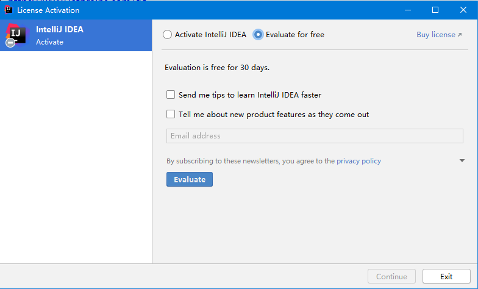
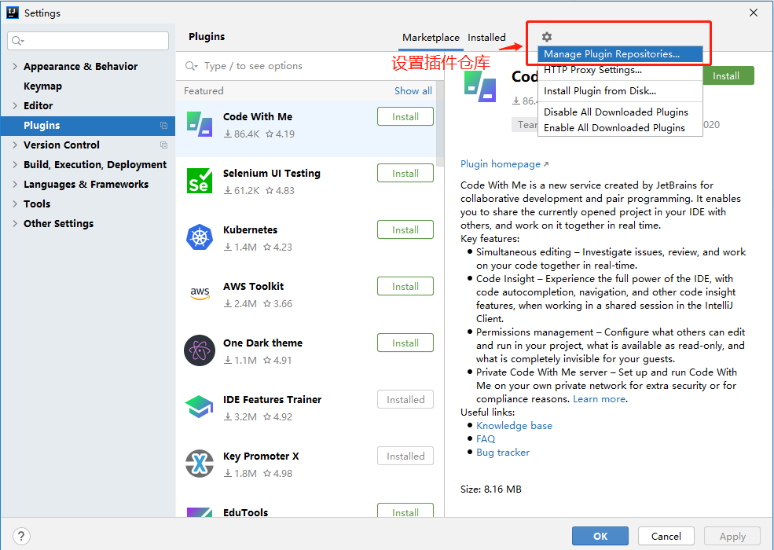
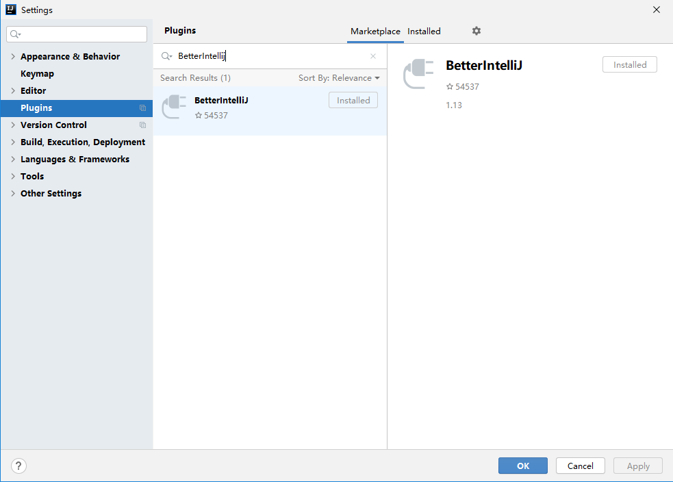
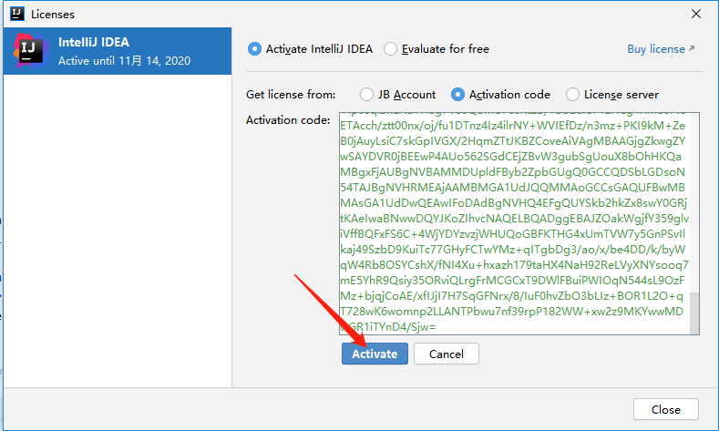
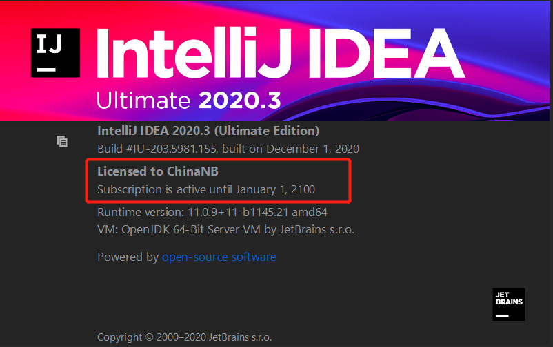

### webStorm 2020.3 激活码,phpStorm 2020.3激活,idea激活,pyCharm激活
>- 直接上代码
>- 技术交流QQ群 `277030213`
### 1.下载
- 安装完成后，选择 ”Evaluate for free“ 免费试用，点击 “Evaluate” 进入 IDE 中，新建或打开一个项目。

>- 说明：如果不能出现这个界面，请打开压缩包执行相应的重置脚本~
>- windows系统：reset_jetbrains_eval_windows.vbs 
>- linux/mac系统：reset_jetbrains_eval_mac_linux.sh
### 2.打开插件中心 File -> Settings -> Manage Plugins Reposito，设置插件中心仓库，如下图所示

### 3.设置仓库地址：`https://repo.idechajian.com` ，如下图所示

- 点击OK，便可以在插件中心，搜索关键字`BetterIntellij`，如下图所示

### 4.安装插件
- 点击安装或者更新，便会提示你，已自动配置好javaagent~
- 这时，必须要`重启IDEA`，才能生效
#### 5.打开注册界面 Help -> Register，选择添加xxx（见key.txt），如下图所示

#### 6.成功 2100年

#### 7.资源下载地址
地址1 [https://545c.com/file/18744103-477393550](https://545c.com/file/18744103-477393550)
备用地址 [https://www.90pan.com/b2215764](https://www.90pan.com/b2215764)
#### 8.请群主喝咖啡

